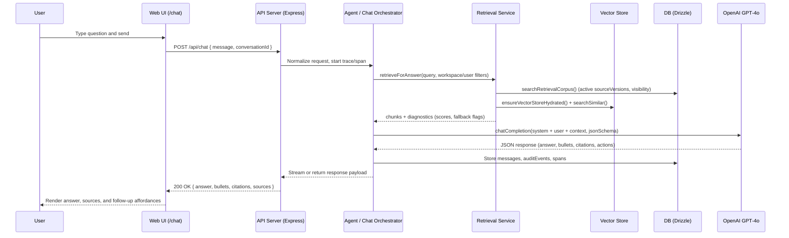

### TracePilot – AI Assistant System Artifact

**TL;DR**
- **What it is**: A production-grade AI assistant that ingests enterprise content (uploads + connectors), builds a retrieval corpus, and answers questions with grounded, cited responses. *(Evidence: `README.md`, `shared/schema.ts`, `server/lib/retrieval.ts`, `server/lib/vectorstore.ts`)*  
- **Who it’s for**: Teams that need a single place to search, reason over, and act on operational knowledge from tools like Google Drive, Atlassian (Jira/Confluence), and Slack. *(Evidence: `README.md`, `server/lib/jobs/handlers/syncHandler.ts`, `shared/schema.ts` connectors + sources)*  
- **Why it matters**: It combines ingestion, RAG, observability, and evaluation so answers are explainable (citations), debuggable (traces/metrics), and guarded by automated eval gates before changes ship. *(Evidence: `README.md` CI Regression Gate, `shared/schema.ts` traces/spans/auditEvents/eval tables, `eval/golden/runner.ts`, `server/lib/observability/prometheus.ts`)*

---

### 1) Shipped Workflow – End-to-End User Journey

- **1. Connect data / upload docs**
  - Admin or user starts the app, configures DB + OpenAI, and connects data sources or uploads documents.
  - Uploads go through `/api/ingest`, where files are queued as jobs and processed asynchronously into sources, source versions, and chunks.  
  - *Evidence: `README.md` “Manual Upload Ingestion (Job-Based)” + `/api/ingest`, `shared/schema.ts` `sources`, `sourceVersions`, `chunks`, `jobs`, `jobRuns`.*

- **2. Build and maintain the knowledge index**
  - The worker (`npm run worker`) runs the job runner, which claims pending jobs, enforces concurrency/rate limits per connector, and runs sync/ingest handlers.  
  - Sync jobs for Google, Atlassian, and Slack decrypt OAuth tokens, page through external content, and write normalized sources + chunks into the shared schema.  
  - *Evidence: `README.md` worker + job runner description, `server/lib/jobs/runner.ts`, `server/lib/jobs/handlers/syncHandler.ts`, `shared/schema.ts` `jobLocks`, `rateLimitBuckets`, `jobs`, `userConnectorAccounts`, `userConnectorScopes`.*

- **3. Ask a question in chat**
  - A logged-in user opens `/chat` and sends a message via the chat API (`POST /api/chat`), creating/using a conversation and storing messages.  
  - *Evidence: `README.md` “Chat” section + `/api/chat`, `shared/schema.ts` `conversations`, `messages`, `server/index.ts` route registration via `registerRoutes`.*

- **4. Retrieve, generate, and return an answer**
  - The backend retrieves relevant chunks for the user’s workspace, using vector search with a lexical fallback and neighbor expansion to build context.  
  - The system calls the LLM (GPT‑4o) with structured prompts and validates the response against a strict `chatResponseSchema` (citations, bullets, optional actions).  
  - *Evidence: `server/lib/retrieval.ts`, `server/lib/vectorstore.ts`, `server/lib/openai.ts`, `shared/schema.ts` `chatResponseSchema` + `citationSchema` + `actionSchema`.*

- **5. Observe, debug, and evaluate**
  - Requests emit traces, spans, Prometheus metrics, and audit events, capturing latency, token usage, retrieval counts, and tool decisions.  
  - Offline + “golden” eval runners score groundedness, hallucinations, and regression deltas before CI passes.  
  - *Evidence: `shared/schema.ts` `traces`, `spans`, `auditEvents`, `eval*` tables + `evalMetricsSchema`, `server/lib/observability/prometheus.ts`, `eval/runner.ts`, `eval/golden/runner.ts`, `README.md` “Evaluation Suite” + “CI Regression Gate”.*

---

### 2) System Design – Architecture Overview

```mermaid
flowchart LR
    subgraph UserLayer
        U[User<br/>Field/Knowledge Worker]
    end

    subgraph Frontend[Web App (Client)]
        FE[React + TypeScript UI<br/>(/chat, /playbooks, admin)]
    end

    subgraph API[Backend API (Node/Express)]
        RTE[HTTP & WebSocket Routes<br/>(/api/chat, /api/ingest, /ws/voice)]
        AG[Agent / Chat Orchestration<br/>(RAG + tools + policies)]
        RET[Retrieval Service<br/>(vector + lexical + neighbor expansion)]
        JOB[Job Runner & Handlers<br/>(sync, ingest, eval, playbook)]
        OBS[Observability<br/>(traces, spans, Prometheus)]
    end

    subgraph Data[Storage & Indexing]
        DB[(Postgres / SQLite<br/>Drizzle ORM)]
        VS[(In-memory Vector Store<br/>+ persisted embeddings)]
    end

    subgraph Integrations[External Systems]
        GDRV[Google Drive]
        JIRA[Jira / Confluence]
        SLK[Slack]
        VOICE[Voice Clients]
    end

    subgraph AI[Model Provider]
        LLM[OpenAI GPT‑4o<br/>+ text-embedding-3-small]
    end

    U --> FE
    FE -->|REST / WS| RTE

    RTE --> AG
    AG --> RET
    AG --> JOB
    AG --> OBS

    RET --> VS
    RET --> DB
    JOB --> DB
    JOB --> VS

    JOB --> GDRV
    JOB --> JIRA
    JOB --> SLK

    AG -->|chatCompletion / embeddings| LLM

    AG --> DB
    OBS --> DB

    VOICE -->|/ws/voice| RTE
```

*Evidence: `server/index.ts` (Express + HTTP server, job runner start), `server/routes.ts` & `server/routes_v2.ts` (API + WebSocket routes), `server/lib/openai.ts` (GPT‑4o + embeddings), `server/lib/retrieval.ts` & `server/lib/vectorstore.ts` (RAG), `server/lib/jobs/runner.ts` & `server/lib/jobs/handlers/syncHandler.ts` (jobs + connectors), `shared/schema.ts` (DB schema), `README.md` (tech stack, endpoints, voice, MCP).*

---

### 3) End-to-End Request Flow (Sequence Diagram)



*Evidence: `server/lib/retrieval.ts` `retrieveForAnswer` + diagnostics, `server/lib/vectorstore.ts` `ensureVectorStoreHydrated` + `searchSimilar`, `server/lib/openai.ts` `chatCompletion`, `shared/schema.ts` `chatResponseSchema`, `conversations`, `messages`, `auditEvents`, `traces`, `spans`, `evalMetricsSchema`, `eval/golden/runner.ts` groundedness scoring, `README.md` chat API docs.*

---

### 4) Data Lifecycle / Pipeline

```mermaid
flowchart TD
    subgraph Ingestion
        UPL[User Uploads File<br/>/api/ingest]
        SYNC[Connector Sync Job<br/>(google/atlassian/slack)]
    end

    subgraph Normalization
        SRC[Create/Update Source<br/>(identity + metadata)]
        VER[Create Source Version<br/>(immutable snapshot)]
        CHK[Chunk Text<br/>(char ranges, token estimates)]
    end

    subgraph Indexing
        EMB[Generate Embeddings<br/>text-embedding-3-small]
        VREF[Persist vectorRef on chunks]
        VSTORE[(Vector Store<br/>in-memory)]
    end

    subgraph RetrievalPipeline
        QRY[User Query]
        CORPUS[searchRetrievalCorpus<br/>(workspace + visibility)]
        SIM[Vector Similarity + Threshold]
        FALLBACK[Lexical Fallback + Hybrid Merge]
        NEIGH[Neighbor Expansion]
        CTX[Assemble Context<br/>(ordered chunks)]
    end

    subgraph Answering
        PROMPT[Prompt + JSON Schema<br/>(chatResponseSchema)]
        CALLLLM[chatCompletion (GPT‑4o)]
        VALIDATE[Schema Validation + Citations]
        STORE[Store Messages + Audit + Traces]
        RESP[Answer + Bullets + Sources]
    end

    UPL -->|enqueueJob(type=ingest)| SYNC
    SYNC --> SRC --> VER --> CHK
    CHK --> EMB --> VREF --> VSTORE

    QRY --> CORPUS --> SIM --> FALLBACK --> NEIGH --> CTX
    CTX --> PROMPT --> CALLLLM --> VALIDATE --> STORE --> RESP
```

*Evidence: `README.md` ingestion + job runner, `shared/schema.ts` `sources`, `sourceVersions`, `chunks`, `jobs`, `jobRuns`, `citationSchema`/`chatResponseSchema`, `server/lib/jobs/runner.ts`, `server/lib/jobs/handlers/syncHandler.ts`, `server/lib/vectorstore.ts`, `server/lib/retrieval.ts`, `server/lib/openai.ts`, `eval/golden/runner.ts` groundedness + metrics.*

---

### 5) Key Components (Purpose + Evidence)

- **Chat & Agent Orchestration**
  - **Purpose**: Turn user chat messages into grounded answers and optional tool actions, while recording conversations and audit events.
  - **What it does**: Handles `/api/chat`, applies trivial/doc-intent routing for fast paths, orchestrates retrieval and LLM calls, and validates responses against `chatResponseSchema` (answer, bullets, citations, actions, sections).  
  - **Evidence**: `README.md` “Chat”, `server/routes.ts` & `server/routes_v2.ts` (chat endpoints, trivial/doc-intent routing referenced in `eval/runner.ts`), `shared/schema.ts` `conversations`, `messages`, `chatResponseSchema`, `actionSchema`, `citationSchema`, `auditEvents`.*

- **Retrieval & RAG Engine**
  - **Purpose**: Build a safe retrieval corpus per workspace and return high-quality chunks for answering.
  - **What it does**: Enforces workspace + visibility boundaries, filters private/Slack private sources, uses vector retrieval with a similarity threshold, falls back to lexical search when confidence is low, merges and reranks results, expands to neighbor chunks, and logs structured diagnostics for each query.  
  - **Evidence**: `server/lib/retrieval.ts` (`searchRetrievalCorpus`, `retrieveForAnswer`, lexical fallback, neighbor expansion, diagnostics + `[RAG]` logs), `server/lib/vectorstore.ts` (`initializeVectorStore`, `ensureVectorStoreHydrated`, `searchSimilar`), `shared/schema.ts` `sources`, `sourceVersions`, `chunks`.*

- **Job Runner & Connector Sync**
  - **Purpose**: Reliably ingest and sync data from uploads and external systems without blocking user requests.
  - **What it does**: Runs a polling job worker with per-connector concurrency and rate limits, exponential backoff, dead-letter queue, and idempotency; sync handler normalizes connector types, decrypts OAuth tokens, runs sync engines, updates jobRun stats, and logs detailed debug traces.  
  - **Evidence**: `server/lib/jobs/runner.ts` (`JobRunner`, `enqueueJob`, concurrency + rate limiting + backoff + dead_letter), `server/lib/jobs/handlers/syncHandler.ts` (normalized connector types; Google/Atlassian/Slack engines; token decryption; progress updates via `statsJson`), `shared/schema.ts` `jobs`, `jobRuns`, `jobLocks`, `rateLimitBuckets`, `userConnectorAccounts`, `userConnectorScopes`.*

- **Observability & Guardrails**
  - **Purpose**: Make every chat/sync/eval operation observable and enforce safety gates in production.
  - **What it does**: Emits Prometheus histograms and counters for chat TTFT, RAG retrieval, LLM latency, tokens, HTTP routes, and errors; stores traces/spans with retrieval counts, similarity ranges, tokens, and errors; records audit events for chat, actions, eval, and sync; rejects production startup if `EVAL_MODE=1`; uses eval metrics and CI thresholds to block regressions.  
  - **Evidence**: `server/lib/observability/prometheus.ts` (Prometheus registry + chat/RAG/LLM/HTTP/error metrics), `shared/schema.ts` `traces`, `spans`, `auditEvents`, `eval*` tables + `evalMetricsSchema` + `regressionDiffSchema`, `server/index.ts` EVAL_MODE guard + API logging, `README.md` “Observability” + “Evaluation Suite” + “CI Regression Gate`.*

- **Evaluation & CI Gate**
  - **Purpose**: Quantify groundedness and prevent regressions in RAG and agent behavior before deployment.
  - **What it does**: Offline eval runner executes fixtures and checks answer/content/latency assertions; golden eval runner drives real queries through the DB + retrieval stack, scores groundedness, hallucinations, numeric mismatches, and citation coverage, then writes JSON + Markdown reports; CI gate fails when thresholds (TSR, unsupported claims, cost per success) regress beyond configured deltas.  
  - **Evidence**: `eval/runner.ts` (offline eval, trivial/doc-intent simulation, assertion checks), `eval/golden/runner.ts` (golden eval pipeline, groundedness metrics, markdown report), `EVAL_RUBRIC.md`, `TEST_MATRIX.md`, `EVAL_RUBRIC.md`, `README.md` “Evaluation Suite” + “CI Regression Gate” thresholds, `eval/golden/scorer.ts` (cited in imports).*

- **Voice & MCP Extensions**
  - **Purpose**: Reuse the same core RAG and observability stack for voice and MCP (tool) channels.
  - **What it does**: Provides a WebSocket `/ws/voice` real-time voice runtime with EOU detection, barge-in, and spans, plus an MCP server exposing TracePilot tools (chat, playbook, actions) via stdio with the same DB and OpenAI backend.  
  - **Evidence**: `README.md` “Voice Agent” + “Voice E2E Tests” + “MCP Mode (stdio) Quickstart`, `VOICE_AGENT_PROOF.md`, `VOICE_IMPLEMENTATION_COMPLETE.md`, `server/mcp/mcpServer.ts` (in tree), `shared/schema.ts` `voiceCalls`, `voiceTurns`, `evalRuns` channel `voice` / `mcp`.*

---

### 6) Reliability / Safety / Guardrails

- **Job reliability**
  - **Retries & backoff**: Jobs use exponential backoff up to a max attempts value (`MAX_ATTEMPTS` default 3), with `shouldRetry` logic that retries 429, 5xx, and timeouts, but avoids infinite retries on 4xx misconfiguration.  
  - **Concurrency & rate limiting**: Per-connector/account locks and token buckets enforce max concurrency and rate caps, preventing overload of external APIs.  
  - **Dead-letter handling**: Failed jobs after max attempts are marked `dead_letter` for inspection instead of silently dropping work.  
  - *Evidence: `server/lib/jobs/runner.ts` `calculateBackoff`, `shouldRetry`, `JobRunner.handleFailure`, `shared/schema.ts` `jobLocks`, `rateLimitBuckets`, `jobs`.*

- **Data and access safety**
  - **Workspace boundaries & visibility**: Retrieval enforces `workspaceId`, visibility (`private` vs `workspace`), and Slack private-channel checks before including content.  
  - **Source versioning & deduplication**: Only active source versions are queried; content hashes prevent re-ingesting identical versions.  
  - *Evidence: `server/lib/retrieval.ts` `searchRetrievalCorpus`, Slack metadata checks, `shared/schema.ts` `sources`, `sourceVersions`, `chunks` index structure and `contentHash` indexes, `README.md` “Source Versioning Flow”.*

- **Model and response safety**
  - **Schema-validated responses**: Chat and playbook responses are validated against explicit Zod schemas (citations list, actions, bullets, sections), making unsupported fields and malformed outputs visible.  
  - **Policy + approvals for tools**: Tool actions (Jira/Slack/Confluence) are modeled as structured actions with policy YAML and approvals tables, so execution can be gated and audited.  
  - *Evidence: `shared/schema.ts` `chatResponseSchema`, `actionSchema`, `policyYamlSchema`, `policies`, `approvals`, `auditEvents` with tool fields.*

- **Runtime safeguards**
  - **Eval mode guard**: The server refuses to boot in production with `EVAL_MODE=1`, avoiding overly-strict “drop all unverified items” evaluation behavior in real traffic.  
  - **Observability-backed triage**: Prometheus metrics, spans, audit events, and job stats provide data for alerting and debugging; voice and RAG paths emit rich telemetry.  
  - *Evidence: `server/index.ts` EVAL_MODE check + API logging, `server/lib/observability/prometheus.ts`, `shared/schema.ts` `traces`, `spans`, `auditEvents`, `jobs`/`jobRuns` `statsJson`.*

- **Cost and regression controls**
  - **Token & cost metrics**: Eval metrics and spans include token usage and latency fields to enable cost-per-success, TSR, and hallucination tracking.  
  - **CI regression gates**: CI fails when task success or unsupported claim metrics regress beyond configured percentages.  
  - *Evidence: `shared/schema.ts` `evalMetricsSchema` (fields like `unsupportedClaimRate`, `avgCostPerSuccess`, `totalTokens`, `totalLatencyMs`), `eval/golden/runner.ts` aggregated metrics, `README.md` “CI Regression Gate” thresholds.*

---

### 7) Impact (Evidence) vs Measurement Plan

- **Impact (evidenced)**  
  - The repo defines **evaluation metrics and thresholds** (task success rate, unsupported claim rate, cost per success, groundedness, hallucinations, numeric mismatches, latency), and it wires them into a CI gate that can block merges when regressions are detected.  
  - However, **no concrete production or user-facing impact numbers (e.g., “X% TSR in deployment” or “Y teams using it”) are stated in the repo.**  
  - **Impact: Not stated in repo.**  
  - *Evidence: `README.md` “Evaluation Suite” + “CI Regression Gate” (TSR drop, unsupported claim rate, cost per success thresholds), `shared/schema.ts` `evalMetricsSchema`, `eval/golden/runner.ts` metrics + report generation, `eval/runner.ts` offline eval runner, `eval/golden/scorer.ts` (imported).*

- **Concrete Measurement Plan (proposed, based on existing hooks)**
  - **Retrieval & grounding**
    - Track: `recallAtK`, `citationIntegrity`, `unsupportedClaimRate`, `avgGroundedClaimRate`, `avgCitationCoverageRate`.  
    - Where: `evalMetricsSchema` in `shared/schema.ts`, generated by `eval/golden/runner.ts` and stored in `evalRuns.metricsJson`.  
    - Success: Maintain or improve TSR and groundedness while keeping unsupported claims and hallucinations below the CI gate thresholds defined in `README.md`.  
  - **User-facing quality**
    - Track: Task success rate (TSR), first-call success rate, average steps to success, loop rate, and cost per success for representative eval suites.  
    - Where: `evalMetricsSchema` + CI pipeline (`README.md` CI gate).  
    - Success: No CI failures on main branch; visible improvements in TSR and reduced cost/latency over time.  
  - **Latency & cost**
    - Track: Chat TTFT, total chat duration, LLM duration, total tokens input/output.  
    - Where: `server/lib/observability/prometheus.ts` histograms/counters, `shared/schema.ts` `spans` token and duration fields.  
    - Success: P50/P95 latencies within SLOs; cost per success (from eval metrics) trending downward or stable.  
  - **Operational robustness**
    - Track: Job success vs dead_letter counts, sync stats (discovered, processed, failed), and error rates.  
    - Where: `server/lib/jobs/runner.ts` logs, `jobRuns.statsJson` in `shared/schema.ts`, `errors_total` metric in `server/lib/observability/prometheus.ts`.  
    - Success: Low dead_letter rate; predictable ingestion and sync performance.

---

### 8) How to Demo in 2 Minutes

**Prereqs** (already documented in repo)
- Have Node, npm, and a Postgres instance (or test DB) as described.  
- Set `DATABASE_URL` and `OPENAI_API_KEY` (or run in proof/offline modes where appropriate).  
- *Evidence: `README.md` “Quick Start”, “Environment Variables”, “Database Setup”, `.env.example`.*

**Step 1 – Start server and worker (30–40 seconds)**
1. In terminal 1:
   - Run: `npm install` (first time only), then `npm run db:push`, then `npm run dev`.  
2. In terminal 2:
   - Run: `npm run worker` to start the job runner.  
3. Confirm app is serving at `http://localhost:5000`.  
   - *Evidence: `README.md` “Quick Start” + “Running the Application”.*

**Step 2 – Ingest a document (30–40 seconds)**
1. In the browser, go to the ingestion UI or use the API:
   - UI: `http://localhost:5000/admin/ingest` (as documented).  
   - Or API:  
     ```bash
     curl -X POST http://localhost:5000/api/ingest \
       -H "Cookie: session=YOUR_SESSION" \
       -F "files=@your-document.pdf"
     ```  
2. Explain: “This creates a `source`, an active `sourceVersion`, and `chunks`, and enqueues an ingest job that the worker will process asynchronously.”  
   - *Evidence: `README.md` “Manual Upload Ingestion (Job-Based)”, `shared/schema.ts` `sources`, `sourceVersions`, `chunks`, `jobs`, `jobRuns`, `server/lib/jobs/runner.ts`.*

**Step 3 – Ask a question and show grounded answer (40–50 seconds)**
1. Open `http://localhost:5000/chat`.  
2. Ask a question that the uploaded doc can answer (e.g., “What are the safety procedures?” as in README).  
3. Point out:
   - The answer text.  
   - The presence of sources/citations and, if UI shows it, per-source details (title, type).  
4. Optional: mention that behind the scenes the system used vector + lexical retrieval, neighbor expansion, and `chatResponseSchema` validation.  
   - *Evidence: `README.md` “Chat”, `server/lib/retrieval.ts`, `server/lib/vectorstore.ts`, `shared/schema.ts` `chatResponseSchema`, `citationSchema`.*

**Step 4 – Mention observability and evaluation (20–30 seconds)**
1. Explain that every request writes traces/spans and Prometheus metrics for latency, retrieval stats, and LLM usage.  
2. Mention that CI runs eval suites and will fail the build if TSR or unsupported claim metrics regress beyond configured thresholds.  
3. (Optional) Show `eval-report.json` or `eval-report.md` generated by running `npm run eval` or golden eval scripts.  
   - *Evidence: `server/lib/observability/prometheus.ts`, `shared/schema.ts` `traces`, `spans`, `eval*` tables, `eval/runner.ts`, `eval/golden/runner.ts`, `eval-report.json`, `README.md` “Evaluation Suite” + “CI Regression Gate”.*

---

### 9) Evidence Map (Claim → Repo Evidence)

| Claim | Evidence file paths |
| ----- | ------------------- |
| TracePilot is a React + TypeScript frontend with a Node/Express backend and Postgres/Drizzle DB | `README.md`, `client/src/main.tsx`, `client/src/App.tsx`, `server/index.ts`, `shared/schema.ts`, `package.json` |
| The system ingests uploads via `/api/ingest` and processes them asynchronously as jobs | `README.md` (Manual Upload Ingestion, `/api/ingest`), `server/routes.ts` / `server/routes_v2.ts` (ingest routes), `shared/schema.ts` `jobs`, `jobRuns`, `sources`, `sourceVersions`, `chunks` |
| Connectors support Google, Atlassian (Jira/Confluence), and Slack with OAuth accounts/scopes | `README.md` (Google/Atlassian/Slack sections), `server/lib/jobs/handlers/syncHandler.ts`, `server/lib/sync/googleSync.ts`, `server/lib/sync/jiraSync.ts`, `server/lib/sync/confluenceSync.ts`, `server/lib/sync/slackSync.ts`, `shared/schema.ts` `userConnectorAccounts`, `userConnectorScopes` |
| Retrieval enforces workspace boundaries, visibility, and Slack private-channel rules | `server/lib/retrieval.ts` (`searchRetrievalCorpus`, visibility + Slack private-channel checks), `shared/schema.ts` `sources`, `sourceVersions`, `chunks` |
| RAG uses embeddings with vector + lexical hybrid retrieval, thresholding, and neighbor expansion | `server/lib/vectorstore.ts` (`createEmbeddings`, `searchSimilar`, in-memory vector store), `server/lib/openai.ts` (OpenAI embeddings + GPT‑4o), `server/lib/retrieval.ts` (`retrieveForAnswer`, SCORE_THRESHOLD, lexical fallback, hybrid merge, neighbor expansion) |
| Chat answers are structured as answer + bullets + citations + optional actions and sections | `shared/schema.ts` `chatResponseSchema`, `bulletSchema`, `citationSchema`, `actionSchema`, `sections` |
| Jobs are retried with exponential backoff and moved to a dead-letter queue after max attempts | `server/lib/jobs/runner.ts` (`calculateBackoff`, `shouldRetry`, `handleFailure`), `shared/schema.ts` `jobs`, `jobRuns` |
| Concurrency and rate limiting are enforced per connector/account | `server/lib/jobs/runner.ts` (concurrency + rate-limit checks), `shared/schema.ts` `jobLocks`, `rateLimitBuckets` |
| Observability includes Prometheus metrics, traces, spans, and audit events | `server/lib/observability/prometheus.ts`, `shared/schema.ts` `traces`, `spans`, `auditEvents`, `README.md` “Observability” |
| Evaluation uses offline and golden runners with groundedness and regression metrics | `eval/runner.ts`, `eval/golden/runner.ts`, `eval/golden/scorer.ts`, `shared/schema.ts` `evalSuites`, `evalCases`, `evalRuns`, `evalResults`, `evalMetricsSchema`, `regressionDiffSchema`, `EVAL_RUBRIC.md`, `TEST_MATRIX.md` |
| CI fails when evaluation metrics regress beyond thresholds (TSR drop, unsupported claims, cost per success) | `README.md` “CI Regression Gate” thresholds, `EVAL_RUBRIC.md`, `eval/golden/runner.ts` metrics, `eval-report.json` / `eval-report.md` outputs |
| Voice agent supports low-latency WebSocket `/ws/voice` with EOU, barge-in, and observability | `README.md` “Voice Agent” + “Voice E2E Tests”, `VOICE_AGENT_PROOF.md`, `VOICE_IMPLEMENTATION_COMPLETE.md`, `shared/schema.ts` `voiceCalls`, `voiceTurns`, `evalRuns` channel `voice`, `server/routes_v2.ts` (voice WebSocket route referenced in README) |
| MCP server exposes TracePilot tools over stdio with the same backend | `README.md` “MCP Mode (stdio) Quickstart”, `server/mcp/mcpServer.ts`, `EVAL_RUBRIC.md` (MCP references) |

